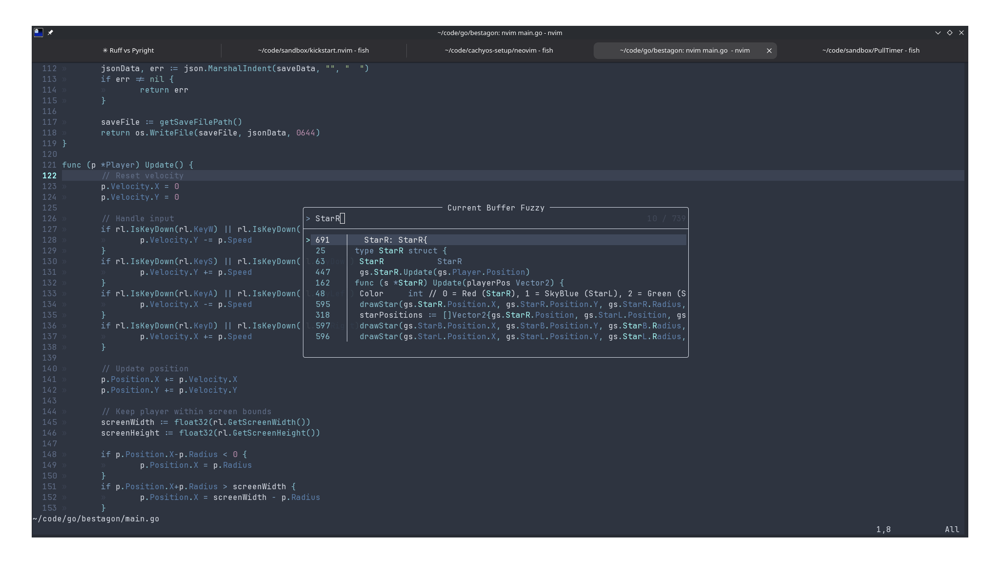

# Neovim Setup



## Dependencies

### Arch Linux / CachyOS

```bash
sudo pacman -S --needed neovim nodejs npm tree-sitter-cli
```

Clipboard (pick one):
```bash
# Wayland
sudo pacman -S wl-clipboard

# X11
sudo pacman -S xclip
```

### macOS

```bash
brew install neovim node tree-sitter ripgrep
```

Clipboard works out of the box (uses pbcopy/pbpaste).

## Install the config

```bash
mkdir -p ~/.config/nvim
cp init.lua ~/.config/nvim/
nvim
```

On first launch:
- Plugins install automatically via lazy.nvim
- LSPs install automatically via Mason (uses npm for pyright, typescript-language-server, etc.)
- Treesitter parsers install automatically

## Keymaps

| Keymap | Action |
|--------|--------|
| `<Space>sf` | Search files |
| `<Space>sg` | Live grep (search text) |
| `<Space>sw` | Search word under cursor |
| `<Space>/` | Fuzzy search in current buffer |
| `<Space><Space>` | Switch buffers |
| `<Space>mp` | Markdown preview toggle |
| `<Space>tp` | Typst preview toggle |
| `<Space>f` | Format buffer |
| `<Space>th` | Toggle inlay hints |
| `grd` | Go to definition |
| `grr` | Go to references |
| `grn` | Rename symbol |
| `gra` | Code action |
