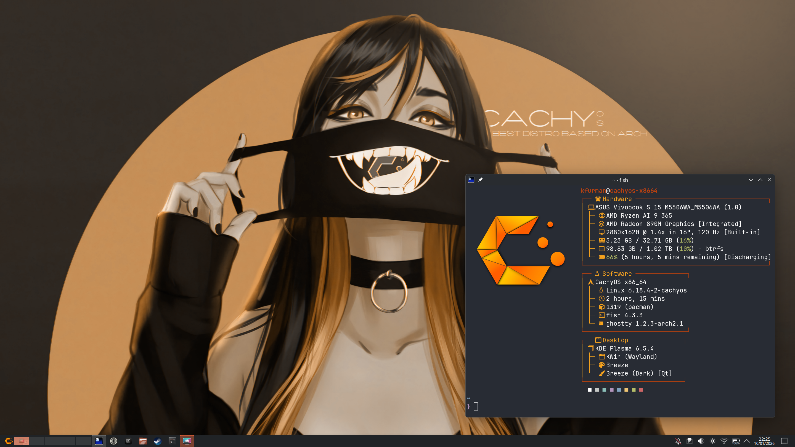

# CachyOS Setup



## Core things:

1. Get a good terminal editor:

```bash
pacman -S ghostty
```

Then make it default in the settings.

2. Install yay:

```bash
git clone https://aur.archlinux.org/yay.git
cd yay
makepkg -si
```

3. Install a good browser:

```bash
yay -S zen-browser-bin
```

And log in to `mozilla account` for sync, `proton pass` for passwords and passkeys, and `github`. Can grab wallpapers from `proton drive` now as well or use some from this repo.

3. Get `arch-browse` to make installing stuff easy.

The repo lives [here](https://github.com/krisfur/arch-browse.git).

```bash
git clone https://github.com/krisfur/arch-browse.git
cd arch-browse
chmod +x arch-browse.sh
sudo mv arch-browse /usr/local/bin/arch-browse
cd ..
rm -rf arch-browse/
```

5. Set up github:
Get `github-cli` using pacman or arch-browse, then run:

```bash
gh auth login
```

And authenticate using your browser. After that config time:

```bash
git config --global user.email "k_furman@outlook.com"
git config --global user.name "Krzysztof Furman"
git config --global init.defaultBranch main
```

## System settings

In the settings we need to change a few things:

1. Add more desktops (We want 5)

Then right click the pager and set it to show windows and icons.

2. Set keybinds:

- switching desktops (`meta+1` etc.)
- moving programs to desktops (`meta+shift+1` etc.)
- maximising (`meta+F`)
- fullscreen (`meta+shift+F`)
- ghostty (`meta+enter`)
- zen (`meta+shift+B`) (add new application)
- btop `meta+shift+T`) (add new application)

or import the included `shortcuts.kksrc` file.

3. Set wallpaper (from `proton drive`), lock screen background, accent colours, and SDMM login screen background.

## Fastfetch config:

From this repo in the `fastfetch/` folder copy the config and the logo to `~/.config/fastfetch/`. Might need to create the folder using `fastfetch --gen-config` or just `mkdir`.

```bash
git clone https://github.com/krisfur/cachyos-setup.git
fastfetch --gen-config
cp cachyos-setup/fastfetch/* ~/.config/fastfetch/
```

## Dev stuff

1. Install `Zed`:

```bash
curl -f https://zed.dev/install.sh | sh
```

and add the `Zedokai` extension and set it to `Zedokai Darker (filter Ristretto)`. All other needed extensions will pop up when you open a file of a certain language.

Afterwards get the `anthropic API` key from `proton pass` and configure that agent, and then use this in zed `settings.json`:

```json
{
  "agent": {
    "default_profile": "write",
    "default_model": {
      "provider": "anthropic",
      "model": "claude-haiku-4-5-latest"
    },
    "model_parameters": []
  },
  "show_edit_predictions": false,
  "ui_font_size": 16,
  "buffer_font_size": 15,
  "theme": {
    "mode": "system",
    "light": "One Light",
    "dark": "Zedokai Darker (Filter Ristretto)"
  },
  "lsp": {
    "vscode-css-language-server": {
      "settings": {
        "css": {
          "lint": {
            "unknownAtRules": "ignore"
          }
        },
        "scss": {
          "lint": {
            "unknownAtRules": "ignore"
          }
        }
      }
    }
  }
}
```

2. Install `uv` (pacman)
3. Install `Rust`:

```bash
curl --proto '=https' --tlsv1.2 -sSf https://sh.rustup.rs | sh
```
4. Install `zig` (pacman)
5. Install `cmake` (pacman)
6. Install `go` (pacman)
7. Install `Kotlin` and `gradle` (pacman)
8. Install `nodejs` and `npm` (pacman), or be a man and install `bun` (pacman)
9. Install `texlive-bin` and then `texlive-latexextra` (pacman)
10. Install `neovim` (pacman) and then `lazyvim`:

```bash
git clone https://github.com/LazyVim/starter ~/.config/nvim
rm -rf ~/.config/nvim/.git
nvim
```

## Troubleshooting issues

1. `DNS` fails to work with Steam Cloud saves (use the desired SSID):

```bash
# 1. Force your Wi-Fi to use Google (8.8.8.8) and Cloudflare (1.1.1.1)
nmcli connection modify "{SSID}" ipv4.dns "8.8.8.8 1.1.1.1"

# 2. Tell it to IGNORE whatever DNS your router is trying to assign
nmcli connection modify "{SSID}" ipv4.ignore-auto-dns yes

# 3. Apply the changes by reloading the connection
nmcli connection up "{SSID}"
```

this happens after installing a system-wide vpn instead of just a browser extension.

2. Turn off `fish` auto-capitalisation which drives me mad:

```bash
set -g fish_case_insensitive 0
```
