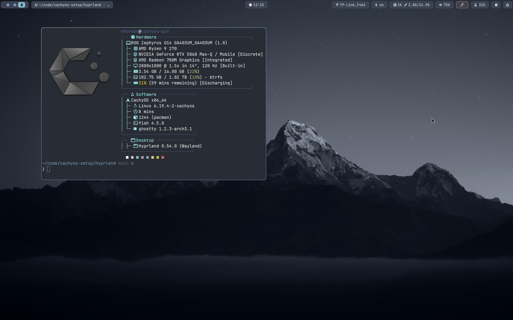
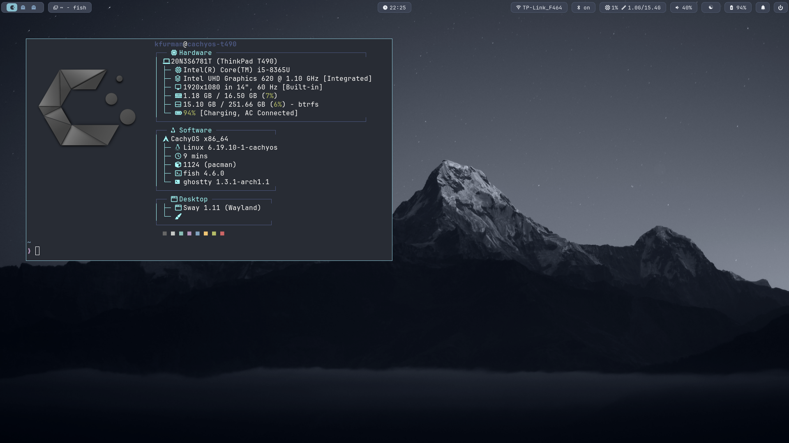
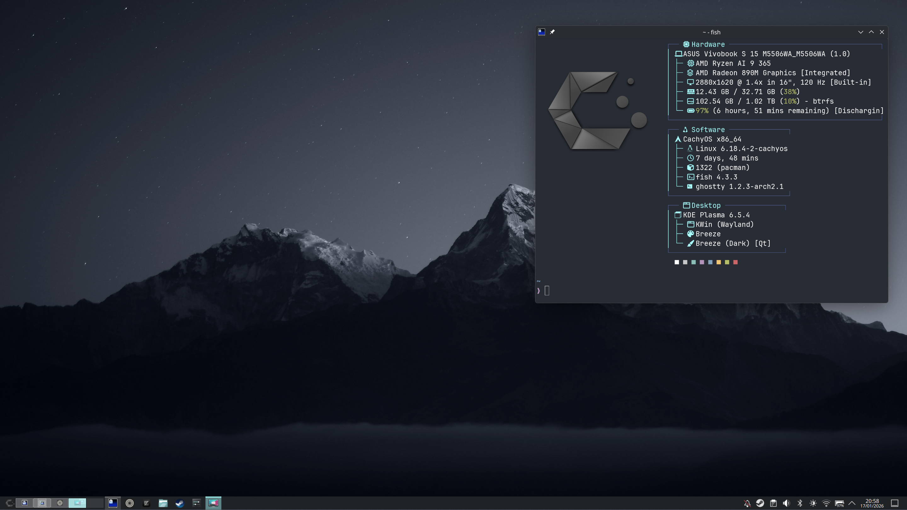

# CachyOS Setup

To grab the latest configs run:

```bash
git submodule update --init --remote --recursive
```

## Shared Dev Tooling

`./setup-hyprland.sh` and `./setup-sway.sh` both bootstrap the shared developer toolchain from `./mise-setup/`.

- `mise` is installed via Arch packages
- `mise-setup/mise/config.toml` is copied to `~/.config/mise/config.toml`
- `mise install` provisions the shared toolchain, including `fex`
- Neovim config is copied from `mise-setup/nvim/`

### Hyprland:


> For `hyprland` instructions see [/hyprland](./hyprland/)

### Sway


> For `sway` instructions see [/sway](./sway/)

### KDE:


> For `KDE` instructions see [/kde](./kde/)
